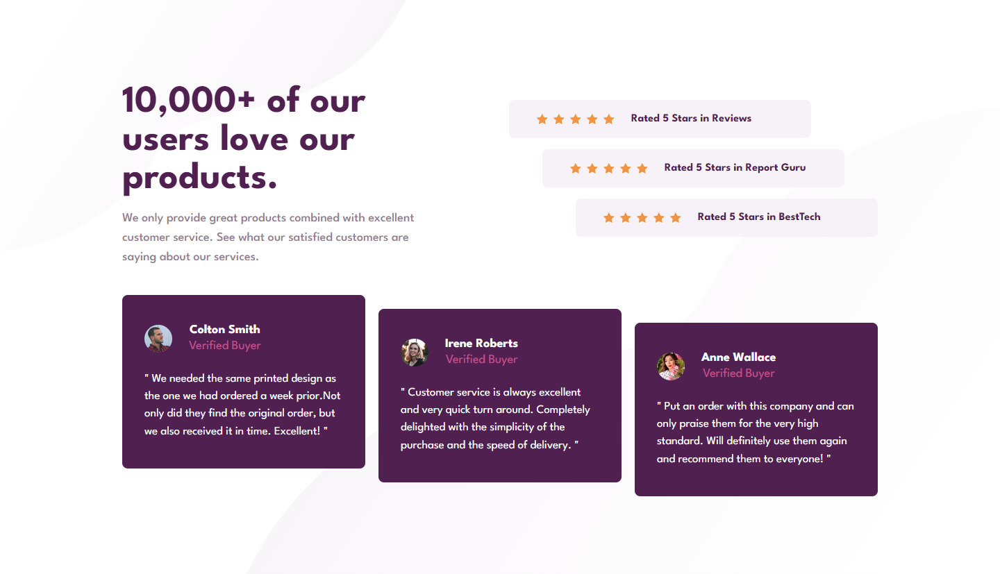

# Frontend Mentor - Social proof section solution

This is a solution to the [Social proof section](https://www.frontendmentor.io/challenges/social-proof-section-6e0qTv_bA).

## Screenshot

## Links

- Solution URL: [here](https://www.frontendmentor.io/solutions/socialproofsection-injJxPoVlq)
- Live Site URL: [here](https://social-proof-section-three-lyart.vercel.app/)

## Built with

- Semantic HTML5 markup
- Flexbox
- Mobile-first workflow
- [React](https://reactjs.org/) - JS frontend library
- [Vite js](https://vitejs.dev/) - Build tool
- [Tailwind](https://tailwindcss.com/) - For styles
